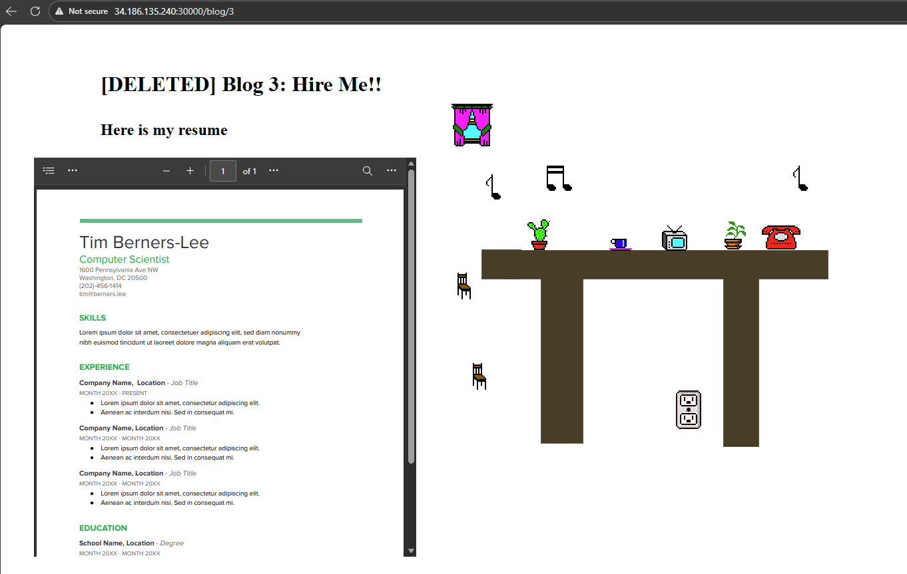
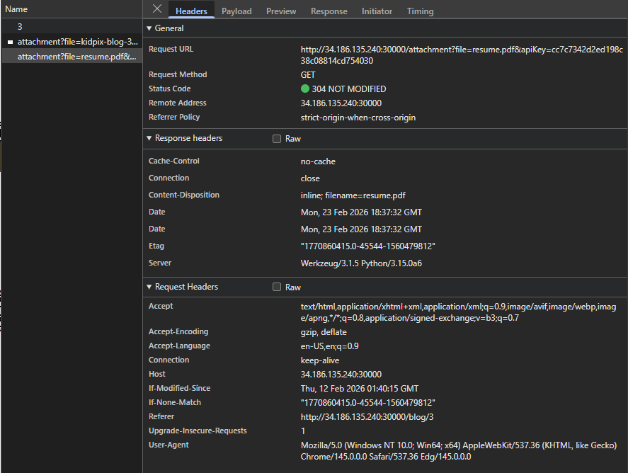
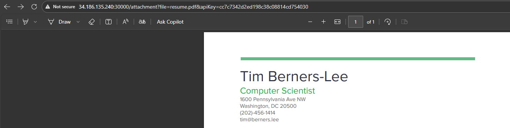
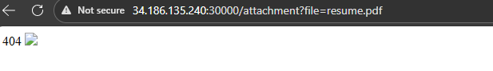
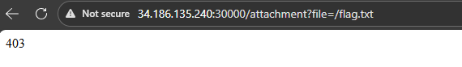
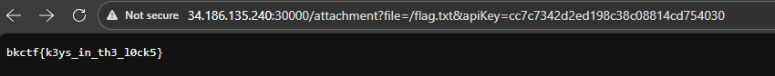

# web/[EASY] My First Blog
> I've been getting into this personal blog thing. It's been really fun but apparently you're not supposed to post certain info on the interwebs. Flag is at /flag.txt

## Background
Opening this challenge, its a pretty default blog website with a few selections.
<body align="left"> 
  
</body>

Digging through the client-side HTML, I didn't notice anything particularly strange. This is the homepage for reference:
```
<body>
    <style>
        body {
            background-image: url("/attachment?file=kidpix-index.png");
        }

        .link-box {
            position: absolute;       
            top: 400px;              
            left: 450px;              
            
            width: 100px;
            padding: 10px;
            text-align: center;
            
            background: green;
            border-radius: 10px;
            box-shadow: 0 5px 20px rgba(0,0,0,0.15);

            transform: scale(1.2);  
            transform-origin: top left;
        }   
        .link-box a:hover {
            background: #4a90e2;
            color: white;
            text-align: center;
        }

        .title {
            position: absolute;       
            top: 400px;              
            left: 850px;              
            
            width: 100px;
            padding: 10px;
            text-align: center;
            
            background: green;
            border-radius: 10px;
            box-shadow: 0 5px 20px rgba(0,0,0,0.15);

            transform: scale(1.2);  
            transform-origin: top left;
        }
    </style>

    <div class="link-box">
        <a href="/blog/1">blog 1</a><br>
        <a href="/blog/2">blog 2</a><br>
        <a href="/blog/4">blog 4</a><br>
    </div>
    <div class='title'>
        <h2>My Blog</h2>
    </div>
</body>
```
Each blog is linked through an href. We are given:

```<a href="/blog/1">blog 1</a><br> ```

```<a href="/blog/2">blog 2</a><br> ```

```<a href="/blog/4">blog 4</a><br> ```

Its pretty telling that we are missing blog 3. 


## Solve
After visiting /blog/2 and then switching the blog identifier to 3, we find a secret page.
<body align="left">
  
</body>

Looking through the page source, we find 
```
<!DOCTYPE html>
<html>
    <body>
        <style>
            body {
                background-image: url("/attachment?file=kidpix-blog-3.png");
            }
            h1 {
                position: absolute;
                top: 50px;
                left: 150px;
            }
            h2 {
                position: absolute;
                top: 125px;
                left: 150px;
            }
            object {
                position: absolute;
                text-align: center;
                top: 200px;
                left: 50px;
            }
                </style>
        <h1> [DELETED] Blog 3: Hire Me!! </h1><br>
        <h2> Here is my resume </h2>
        <!-- i had to delete this bc it has my personal info on it :( -->
        <!-- for documents in the 'other' folder only people with the API key has access -->
        <object data="/attachment?file=resume.pdf&apiKey=cc7c7342d2ed198c38c08814cd754030" type="application/pdf" width="30%" height="600px">
    </body>
</html>
```
This API key is also shown in our network log when accessing the page.
<body align="left">
  
</body>

Now what can this API key be used for?

Well looking that the client-side code, we see

``` <object data="/attachment?file=resume.pdf&apiKey=cc7c7342d2ed198c38c08814cd754030" type="application/pdf" width="30%" height="600px"> ```
/attachment?file= seems to obtain a file from the backend. Given the challenge description says "Flag is at /flag.txt", theres definitely a way to read internal files here.

Opening up the resume link, the server returns just that resume image. 
<body align="left">
  
</body>

Removing the apiKey parameter, we are met with 404 error and an empty image.
<body align="left">
  
</body>

Switching the parameter to /flag.txt we are met with a 403 Forbidden. This means that we don't have the privileges to access that resource.
<body align="left">
  
</body>

But we have the API key from earlier. After appending the API key parameter to the end of our request, we get the flag.
<body align="left">
  
</body>


