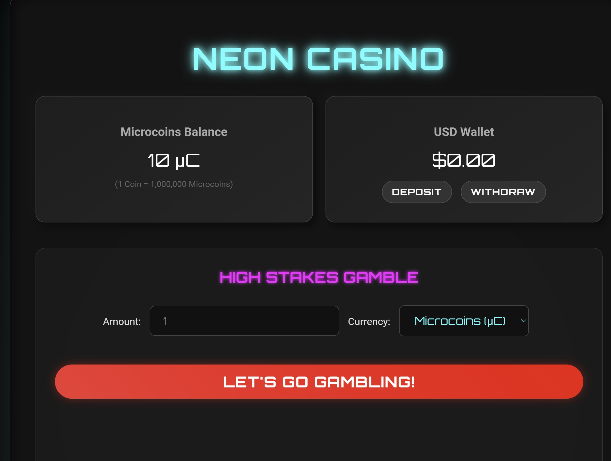
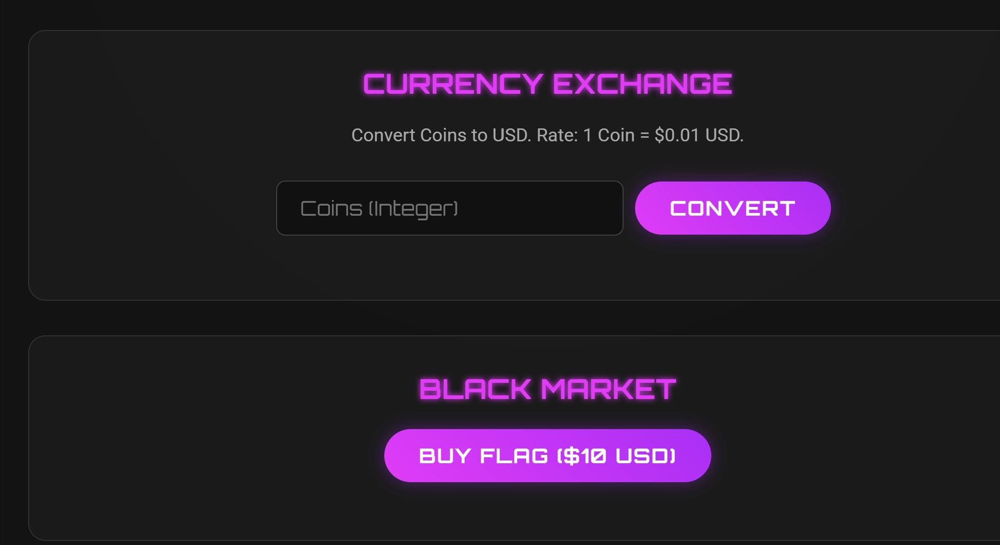
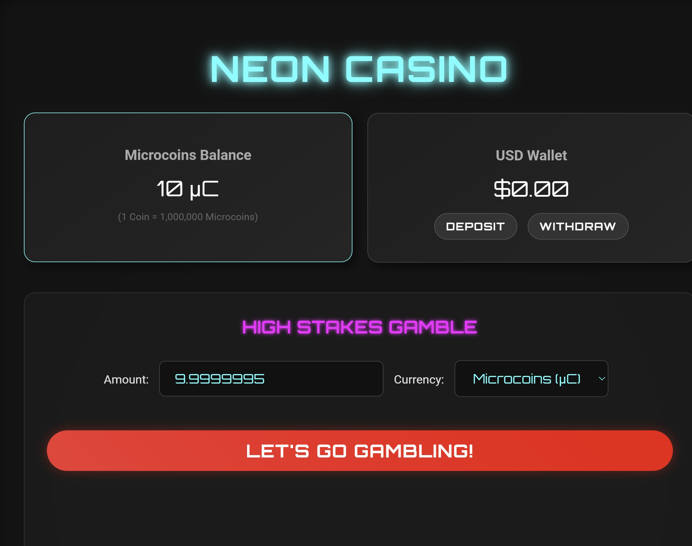
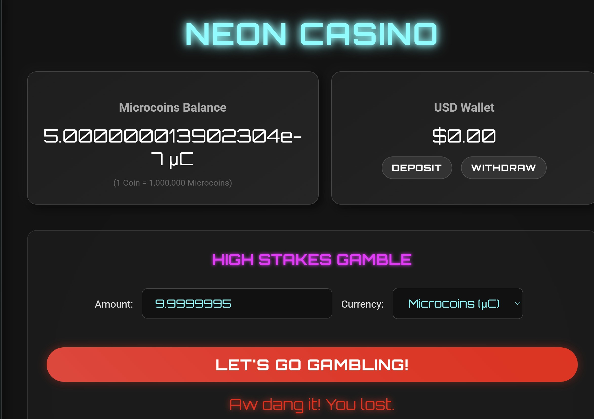

# GambleCore
> Let's go gambling!

## Background
The challenge presents as a generic casino which allows gambling of currency called "Microcoins"
<p align="left"> 
  
</p>
There is a Currency Exchange functionality and a Black Market functionality to obtain the flag. Thus, I immediately thought that the most likely solve is to 
somehow obtain enough USD to purchase the flag. But how?
<p align="left">
  
</p>

Looking at the starting Microcoins balance of 10, it's pretty clear that its (almost) impossible to obtain the flag purely from gambling off our default money. 

Given that 1 coin = 1,000,000 microcoins, we'd have to successfully gamble 6 times in a row to obtain the flag. Looking at the code however, theres a 9% chance to win 
each gambling attempt. 
```
   // 9% chance to win
    const win = secureRandom() < 0.09;
    let winnings = 0;
```
This led me straight to the source code.

```

app.post('/api/gamble', (req, res) => {
    const { currency, amount } = req.body;
    
    if (!['coins', 'usd'].includes(currency)) {
        return res.status(400).json({ error: 'Invalid currency' });
    }

    let betAmount = parseFloat(amount);
    if (isNaN(betAmount) || betAmount <= 0) {
        return res.status(400).json({ error: 'Invalid amount' });
    }

    const wallet = req.session.wallet;
    
    if (currency === 'coins') {
        if (betAmount > wallet.coins) {
            return res.status(400).json({ error: 'Insufficient funds' });
        }
    } else {
        if (betAmount > wallet.usd) {
            return res.status(400).json({ error: 'Insufficient funds' });
        }
    }

    // Deduct bet
    if (currency === 'coins') wallet.coins -= betAmount;
    else wallet.usd -= betAmount;

    // 9% chance to win
    const win = secureRandom() < 0.09;
    let winnings = 0;

    if (win) {
        winnings = betAmount * 10;
        if (currency === 'coins') wallet.coins += winnings;
        else wallet.usd += winnings;
    }

    res.json({
        win: win,
        new_balance: currency === 'coins' ? wallet.coins : wallet.usd,
        winnings: winnings
    });
});
```
The gamble API itself didnt look too vulnerable. I attempted fuzzing it with non-standard inputs, but no payloads seemed to get across. Thus, I moved on to the convert API.

```
app.post('/api/convert', (req, res) => {
    let { amount } = req.body;

    const wallet = req.session.wallet;
    const coinBalance = parseInt(wallet.coins);
    amount = parseInt(amount);
    if (isNaN(amount) || amount <= 0) {
        return res.status(400).json({ error: 'Invalid amount' });
    }
    
    if (amount <= coinBalance && amount > 0) {
        wallet.coins -= amount;
        wallet.usd += amount * 0.01;
        return res.json({ success: true, message: `Converted ${amount} coins to $${(amount * 0.01).toFixed(2)}` });
    } else {
        return res.status(400).json({ error: 'Conversion failed.' });
    }
});
```
This doesn't immediately look vulnerable, but I did hear about some weird functionality with parsing values in certain languages. After researching a bit online, it seems i was correct. The following are some examples that I found from my research:

parseInt("0x1A") -> 26 (octal notation)

parseInt("abc123") -> NaN

parseInt("123abc") -> 123 (non-integer dropped)

parseInt(123.99) -> 123 (decimal dropped)


I did attempt to gamble hoping for some sort of rounding error to obtain infinite coins, but none of these succeeded. 

Eventually, I stumbled upon this article: https://dmitripavlutin.com/parseint-mystery-javascript/

Essentially, Javascript will automatically convert small values into exponent form. For example, 0.00000005 will be automatically converted to 5e^-7.

There is a massive issue with this. As seen above, parseInt will automatically drop any string characters that are not integer values. 

This will result in parseInt(0.00000005) convert into 5...

The full chain looks like this:

Input: 0.00000005
```
1. 0.00000005
Javascript automatically converts to exponential notation
2. 5e^-7
3. parseInt(5e^-7)
parseInt only parses up to valid integer values, so anything after the 5 is dropped
4. 5
Return value: 5
```
# Obtaining the flag
Utilizing this exploit, I aimed to convert our balance to 5e^-7. To do this, I gambled away all of the excess cash.
<p align="left">
  
</p>

The result is exactly as I was hoping for. Javascript automatically converted the balance to 5e^-7.
<p align="left">
  
</p>

Knowing that the convert API uses the parseInt function, I attempted to convert 5 coins into USD. 

<p align="left">
  
</p>
Now that my gambling funds have increased by 5 million, I immediately sought to gamble it all away. At this point, I only needed to hit 3 wins in a row before having enough funds to purchase the flag. 

Solve script coming soon
## References
https://dmitripavlutin.com/parseint-mystery-javascript/
https://coderwall.com/p/4eaixa/parseint-can-be-dangerous
https://logicalhunter.me/exploiting-number-parsers-in-javascript/
