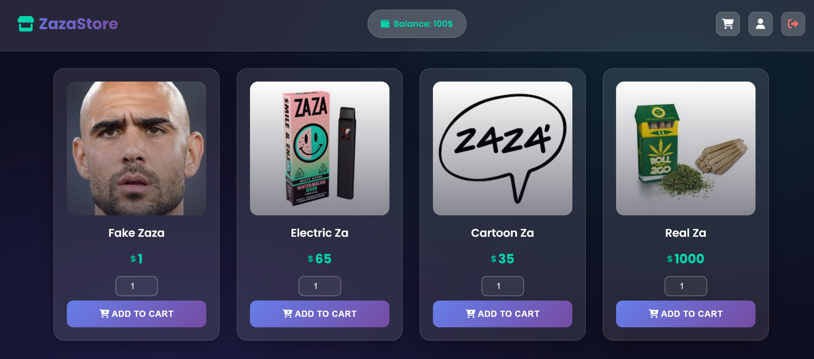
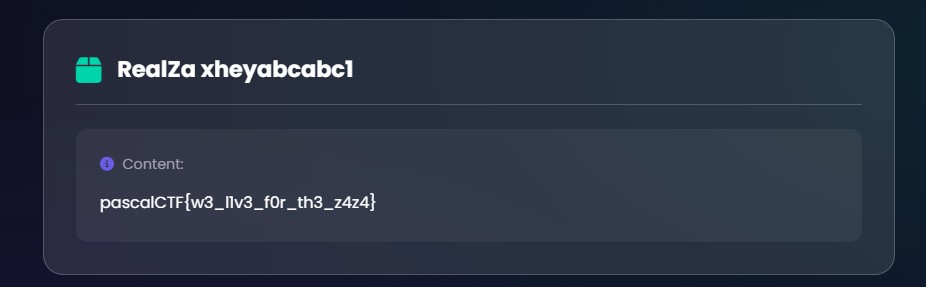

# ZazaStore
> We dont take any responsibility in any damage that our product may cause to the user's health

## Background
Upon entering the challenge, we are given a default login page.
<p align="left">
  
</p>
When logging in, there is a dashboad with the ability to purchase some items:
<p align="left">
  
</p>

There is added functionality for adding an item to your cart, and then purchasing it. Here is what it 
looks like after purchasing an item:
<p align="left">
  
</p>
Our goal is to obtain the RealZa item which costs 1000 USD. 

## Looking at the code
Taking a look at the source code of the challenge, there are some interesting bits.

The /login endpoint has no functionality at all. All it checks is that you entered a username and password.
```  
app.post('/login', (req, res) => {
    const { username, password } = req.body;
    if (username && password) {
        req.session.user = true;
        req.session.balance = 100;
        req.session.inventory = {};
        req.session.cart = {};
        return res.json({ success: true });
    } else {
        res.json({ success: false });
    }
});
```

The /add-cart endpoint doesn't check if the item you are attempting to add exists. It just adds it anyeways.
```
app.post('/add-cart', (req, res) => {
    const product = req.body;
    if (!req.session.cart) {
        req.session.cart = {};
    }
    const cart = req.session.cart;
    if ("product" in product) {
        const prod = product.product;
        const quantity = product.quantity || 1;
        if (quantity < 1) {
            return res.json({ success: false });
        }
        if (prod in cart) {
            cart[prod] += quantity;
        } else {
            cart[prod] = quantity;
        }
        req.session.cart = cart;
        return res.json({ success: true });
    }
    res.json({ success: false });
});
```
But the most interesting bit is the /checkout endpoint.
```
app.post('/checkout', (req, res) => {
    if (!req.session.inventory) {
        req.session.inventory = {};
    }
    if (!req.session.cart) {
        req.session.cart = {};
    }
    const inventory = req.session.inventory;
    const cart = req.session.cart;

    let total = 0;
    for (const product in cart) {
        total += prices[product] * cart[product];
    }

    if (total > req.session.balance) {
        res.json({ "success": true, "balance": "Insufficient Balance" });
    } else {
        req.session.balance -= total;
        for (const property in cart) {
            if (inventory.hasOwnProperty(property)) {
                inventory[property] += cart[property];
            }
            else {
                inventory[property] = cart[property];
            }
        }
        req.session.cart = {};
        req.session.inventory = inventory;
        res.json({ "success": true });
    }
});
```
The code here takes the quantity of each item purchased, then multiplies it by the price of the product. 
It then compares if the total price of your purchase is less than money in your wallet. 

## Solve
Taking a closer look at the /checkout endpoint, we see that there are very minimal checks on the quantity 
of each item purchased. The only validation the app does is check whether the quantity is a value greater 
than 1.

It should be noted that there are no validation checks on whether the inputted quanitity is an integer or not.
Integer comparison towards a string can result in some unexpected behavior. 

After opening up Burp and taking a look at the request, we can forge the quantity request to be a string. 
<p align="left">
  
</p>
The server readily accepts our input. Upon comparing our total wallet balance with the input, the server compares 

```
 if (total > req.session.balance) {
        res.json({ "success": true, "balance": "Insufficient Balance" });
    } else {
        req.session.balance -= total;
        for (const property in cart) {
            if (inventory.hasOwnProperty(property)) {
                inventory[property] += cart[property];
            }
            else {
                inventory[property] = cart[property];
            }
        }
        req.session.cart = {};
        req.session.inventory = inventory;
        res.json({ "success": true });
    }
```
This evaluates to False in Javascript, and thus our request will pass the check.
<p align="left">
  
</p>
Opening the inventory, we obtain the flag.
<p align="left">
  
</p>
