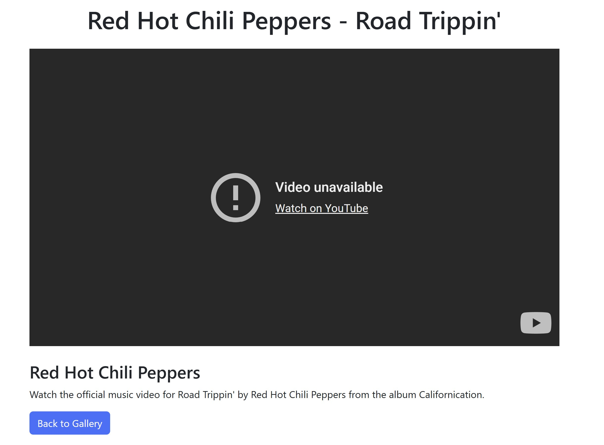
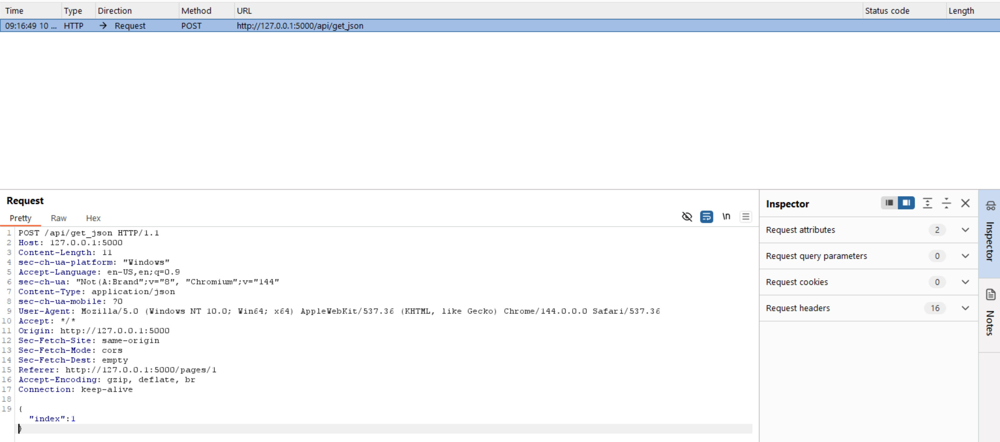
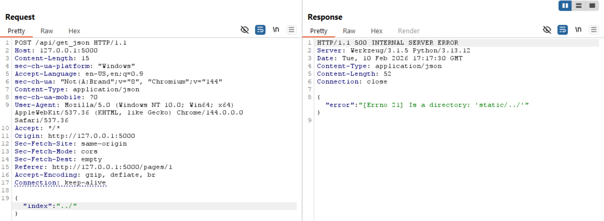
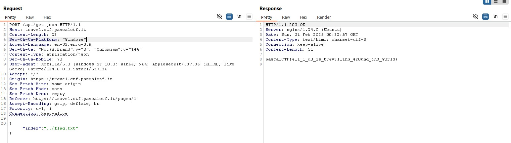

# Travel Playlist
> Nel mezzo del cammin di nostra vita
mi ritrovai per una selva oscura, 
ché la diritta via era smarrita.

## Background
Upon entering the challenge, we are given a simple fetch API for video playlists.

  

Indexing from 1-7 returns random youtube videos unique to each index.

  

Upon fuzzing around, we notice a unique endpoint that fetches these youtube videos. A POST 
request is sent with an input of "index": ${index}. 

  

Fuzzing with directory traversal, we got:

  

## Solve
Once that error message was disclosed, it was extremely obvious that this was going to be a directory
traversal. Given the general structure of a Flask app, we can easily find the flag through traveling to
"../flag.txt"

  

