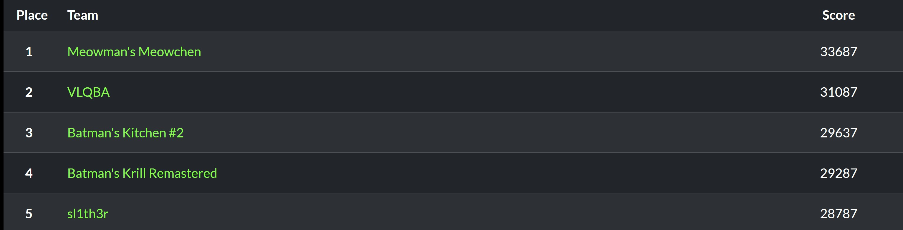

Pretty fun in-person CTF. Most of the challenges were super easy. 
<body align="left">
  
</body>

We ended up finishing 5th as a duo, despite team sizes being 5. That was because I got hard carried by my teammate. who full-solved every category except for web and misc. 
I ended up doing all of the web and most of the misc challenges. The web challenges were extremely easy and are not worth making a writeup on. 
I was surprised by how fun the LLM challenges were and am considering having that as one of my secondary topics.

Also, these writeups aren't going to be very intuitive because the challenge infrastructure was taken down the day of the competition ending and I
wasn't able to get any screenshots.
